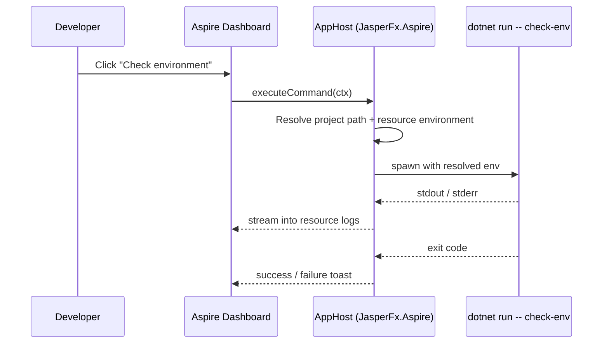

# Aspire Dashboard Integration

The `JasperFx.Aspire` package surfaces a JasperFx application's command-line verbs — `check-env`,
`describe`, `codegen`, `resources`, `projections` — as **clickable custom commands** on the
resource tile in the [.NET Aspire](https://learn.microsoft.com/en-us/dotnet/aspire/) dashboard.

Every JasperFx-bootstrapped application already answers these verbs because `Program.cs` ends in
`RunJasperFxCommands(args)` (see [Setup & Integration](/cli/)). Instead of dropping to a terminal to
run `check-env`, rebuild projections, or apply schema changes, a developer running their Aspire
AppHost can click a button on the running service and watch the output stream into the dashboard.

Because Marten, Wolverine, and Polecat all build on the same JasperFx command infrastructure, a
single package lights this up for the entire Critter Stack.

## Installation

Add the package to your Aspire **AppHost** project (not the service itself):

```bash
dotnet add package JasperFx.Aspire
```

`JasperFx.Aspire` targets .NET 10 and requires .NET Aspire 9.2 or later (built and tested against
Aspire 13.x).

## Basic usage

Call `WithJasperFxCommands()` on a project resource in your AppHost:

```cs
var builder = DistributedApplication.CreateBuilder(args);

builder.AddProject<Projects.Api>("api")
    .WithJasperFxCommands();

builder.Build().Run();
```

By default this adds the **read-only** verbs, enabled while the resource is running, with no
confirmation prompt:

| Button                 | Verb              | What it does                                              |
|------------------------|-------------------|-----------------------------------------------------------|
| **Check environment**  | `check-env`       | Runs all of the application's environment checks.         |
| **Describe**           | `describe`        | Writes a description of the app's configuration to the logs. |
| **Preview generated code** | `codegen preview` | Previews the code JasperFx would generate at runtime.  |

## Mutating verbs

The verbs that change state are opt-in and each prompt for confirmation before running. Enable them
with `IncludeMutatingCommands`:

```cs
builder.AddProject<Projects.Api>("api")
    .WithJasperFxCommands(opts =>
    {
        opts.IncludeMutatingCommands = true; // adds: Apply resources, Rebuild projections, Write generated code

        // Tweak the presentation of any verb
        opts.For("projections").ConfirmationMessage =
            "Rebuild projections for 'api'? This reprocesses the event store.";
    });
```

| Button                 | Verb               | What it does                                                       |
|------------------------|--------------------|--------------------------------------------------------------------|
| **Apply resources**    | `resources setup`  | Creates/updates databases, schema, queues, and other infrastructure. |
| **Rebuild projections**| `projections rebuild` | Rebuilds all asynchronous projections from the event store.     |
| **Write generated code** | `codegen write`  | Generates the runtime code ahead of time and writes it to disk.    |

`JasperFxCommandOptions` also exposes `IncludeVerbs` (an explicit allow-list that replaces the
defaults) and `ExcludeVerbs` (to drop individual verbs from the selection).

## Adding a single command

Use `WithJasperFxCommand` to add one verb — a standard verb, a product-specific verb (e.g. Marten's
`projections`), or your own [custom command](/cli/writing-commands) — with optional fixed arguments:

```cs
builder.AddProject<Projects.Api>("api")
    .WithJasperFxCommand("resources", "setup")
    .WithJasperFxCommand("storage", "rebuild", reg =>
    {
        reg.DisplayName = "Rebuild storage";
        reg.IconName = "DatabaseArrowUp";
    });
```

Unknown verbs are treated as mutating (safe-by-default) and get a confirmation prompt unless you
override it.

## How it works

The dashboard command callback runs **inside the AppHost process**, not the target application. To
run a verb against the service — with its own DI container, configuration, and (critically) the same
Aspire-managed environment, including connection strings to Aspire-managed dependencies — the
callback spawns a short-lived child process of the same application:

```bash
dotnet run --project <api>.csproj --no-build -- <verb> <args>
```

The child inherits the AppHost's environment, and on top of that the resource's *resolved*
environment is applied — evaluated from the resource's Aspire environment annotations (the same
values Aspire injects into the running process, such as `ConnectionStrings__*`). The child's
`stdout`/`stderr` stream into the resource's **Console logs** in the dashboard, and its exit code
maps to a success or failure toast.



This reuses the exact CLI path the framework already supports — the target application needs no
changes beyond the `RunJasperFxCommands(args)` it already calls.

## Safety

- **Read-only verbs** (`check-env`, `describe`, `codegen preview`) are enabled while the resource is
  running, with no confirmation.
- **Mutating verbs** (`codegen write`, `resources`, `projections`) require explicit opt-in via
  `IncludeMutatingCommands` and prompt for confirmation before running.
- The buttons are disabled unless the resource is running, so the child process always has something
  to run against. Override per verb with `JasperFxCommandRegistration.UpdateState`.

## Requirements

- The target must be a **project resource** (`AddProject<T>`) — the integration locates the project
  to launch from the resource's project metadata.
- .NET Aspire 9.2+ (the `CommandOptions` overload of `WithCommand`).
