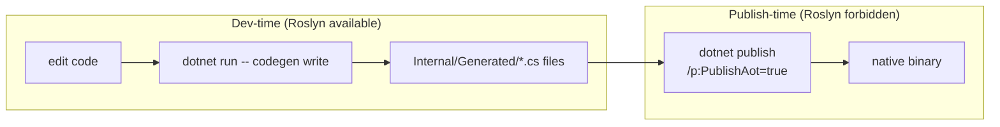

# Publishing AOT with JasperFx

This guide walks through publishing a .NET application that uses JasperFx (and the rest of the Critter Stack) with **Native AOT** (`dotnet publish /p:PublishAot=true`). Native AOT ahead-of-time-compiles the app to a self-contained native binary with no JIT and aggressive trimming, which means:

- **Startup is near-instant** — no JIT warmup, no Roslyn loading.
- **Publish size is small** — typically 15-40 MB self-contained, comparable to a Go binary.
- **No runtime code generation** — anything that needs `Reflection.Emit`, `Type.MakeGenericType`, or `Activator.CreateInstance(Type)` on a type the trimmer didn't statically see will warn at publish time and may fail at runtime.

JasperFx 2.0 is the first release where AOT publishing is a supported posture for apps that don't need runtime code generation. JasperFx and JasperFx.Events 2.0.0-alpha.12+ build with `IsAotCompatible=true` and 0 IL warnings; the rest of the Critter Stack family (Marten, Wolverine, Polecat) is on the same arc.

::: tip Prerequisites
- .NET 9 or 10 SDK
- An application using `TypeLoadMode.Static` (see [CLI: codegen Command](./cli.md))
- All Critter Stack packages at the 2026-wave alphas or later (JasperFx 2.0, JasperFx.Events 2.0, Weasel 9.0, Marten 9.0, Wolverine 6.0, Polecat 4.0)
:::

## The two-phase model

AOT publishing splits the codegen pipeline across two clearly-distinct phases:



**Dev-time** is the Roslyn path: you write configuration code, run `codegen write` (which loads Roslyn + JasperFx.RuntimeCompiler), and the generated `*.cs` files land in `Internal/Generated/` next to your source. You commit those files.

**Publish-time** is the Roslyn-free path: the published binary contains only the pre-generated code. No `Microsoft.CodeAnalysis.*`, no `JasperFx.RuntimeCompiler`, no `MakeGenericType` on unknown types.

## Setup

### 1. Reference the right packages

```xml
<Project Sdk="Microsoft.NET.Sdk">

    <PropertyGroup>
        <OutputType>Exe</OutputType>
        <TargetFramework>net10.0</TargetFramework>
        <IsAotCompatible>true</IsAotCompatible>
        <PublishAot>true</PublishAot>

        <!-- Recommended: fail the publish build on any new IL warning -->
        <WarningsAsErrors>IL2026;IL2046;IL2055;IL2065;IL2067;IL2070;IL2072;IL2075;IL2090;IL2091;IL2111;IL3050;IL3051</WarningsAsErrors>
    </PropertyGroup>

    <ItemGroup>
        <!-- Critter Stack foundation -->
        <PackageReference Include="JasperFx" Version="2.0.0-alpha.12" />
        <PackageReference Include="JasperFx.Events" Version="2.0.0-alpha.5" />

        <!-- Marten / Wolverine / Polecat as needed -->
        <!--   <PackageReference Include="Marten" Version="..." /> -->
        <!--   <PackageReference Include="WolverineFx" Version="..." /> -->
        <!--   <PackageReference Include="Polecat" Version="..." /> -->
    </ItemGroup>

    <!--
    JasperFx.RuntimeCompiler is referenced ONLY at dev-time so `codegen write`
    has access to Roslyn. It is intentionally absent from the production publish
    so the trimmer drops the entire Microsoft.CodeAnalysis.* graph.
    -->
    <ItemGroup Condition="'$(Configuration)' == 'Debug'">
        <PackageReference Include="JasperFx.RuntimeCompiler" Version="2.0.0-alpha.2" />
    </ItemGroup>

</Project>
```

Key points:

- **`IsAotCompatible=true`** turns on the IL2026 / IL2070 / IL2075 / IL3050 analyzers so any new reflective surface in *your* code surfaces at compile time.
- **`PublishAot=true`** triggers Native AOT at publish.
- **`WarningsAsErrors=IL...`** is the policy enforcer — without it the analyzer warnings are easy to lose in build noise. The list above mirrors what the [JasperFx AOT smoke-test consumer in CI](https://github.com/JasperFx/jasperfx/tree/main/src/JasperFx.AotSmoke) uses.
- **`JasperFx.RuntimeCompiler` is conditional on `Debug`** so the production publish (`Configuration=Release`) never sees Roslyn. Adjust the condition to whatever fits your build pipeline; the rule is just "not referenced in the AOT publish."

### 2. Configure JasperFx for Static mode

```csharp
var builder = WebApplication.CreateBuilder(args);

builder.Services.CritterStackDefaults(opts =>
{
    opts.Production.GeneratedCodeMode = TypeLoadMode.Static;

    // Development can still use Dynamic so iteration is fast
    opts.Development.GeneratedCodeMode = TypeLoadMode.Dynamic;
});
```

In `Production` profile the host loads pre-generated types directly from the compiled assembly. No Roslyn invocation. If a generated type is missing, the app throws at startup rather than silently regenerating — which is the right failure mode for AOT publishing.

### 3. Don't call `AddRuntimeCompilation()`

JasperFx 2.0 split the runtime compiler into an opt-in seam:

```csharp
// Calling this in your composition root pulls JasperFx.RuntimeCompiler +
// Microsoft.CodeAnalysis.* into the production graph. Omit it for AOT.
//
//   services.AddRuntimeCompilation();   // ← intentionally NOT called
```

Omitting the call lets the trimmer drop the entire Roslyn graph from the published binary.

## Workflow

### Dev-time: write the generated code

After every meaningful change to your composition (handlers, projections, document mappings, etc.) regenerate the cached code:

```bash
dotnet run -- codegen write
```

This produces files under `Internal/Generated/` — these go into source control. The codegen output is deterministic across runs ([PR #196](https://github.com/JasperFx/jasperfx/pull/196)), so you'll see byte-identical diffs when nothing has changed.

::: tip CI integration
A common pattern is to run `dotnet run -- codegen write` in CI and fail the build if it produces a diff. That catches "someone changed configuration but forgot to regenerate" before it bites the AOT publish.
:::

### Publish-time: produce the native binary

```bash
dotnet publish -c Release /p:PublishAot=true -r linux-x64 -o ./publish
```

A successful publish produces a single self-contained binary (plus a few native dependency `.so` / `.dll` files) under `./publish`. The Roslyn graph is gone; the binary loads the pre-generated types out of itself with no compilation.

If publish fails with IL warnings-as-errors, the build output tells you exactly which line in your code (or in a downstream package) reaches a reflective surface that isn't annotated. Common cases:

| Error | Likely cause | Fix |
|---|---|---|
| `IL2026: …RequiresUnreferencedCodeAttribute` on a Critter Stack API | You're calling an API that JasperFx / Marten / Wolverine has annotated `[RequiresUnreferencedCode]`. | Either avoid the API in the AOT publish path, or wrap the call site with `[UnconditionalSuppressMessage]` + a justification (and accept that the trim risk is on you). |
| `IL3050: …RequiresDynamicCodeAttribute` on `MakeGenericType` / `Activator.CreateInstance` in your own code | You're doing reflection. | Refactor to source-generated code, or to `JasperFx.Core.Reflection.GenericFactoryCache.BuildAs<T>(...)` with a delegate factory. |
| `Unable to load type 'X' from assembly 'Y' at runtime` | The trimmer dropped a type that was reachable only by reflection. | Annotate the reflective call site with `[DynamicallyAccessedMembers]` on the relevant `Type` parameter, or add a `[DynamicDependency]` to keep the type alive. |

### Verification

The published binary should run with no AOT-specific warnings on the console:

```bash
./publish/MyApp
# (no warnings about "Generated native code might not be available at runtime")
```

For a smoke-level confidence check, JasperFx's repo includes [`src/JasperFx.AotSmoke`](https://github.com/JasperFx/jasperfx/tree/main/src/JasperFx.AotSmoke) — a tiny app that consumes the AOT-clean cross-section of the JasperFx + JasperFx.Events surface with all the IL warning codes promoted to errors. Mirroring its pattern in your own repo is a good way to catch regressions early.

## What's annotated vs. AOT-clean

As of JasperFx 2.0.0-alpha.12 and JasperFx.Events 2.0.0-alpha.5:

### AOT-clean (no annotation; safe in AOT publishes)

- `JasperFx.Events.Event.For<T>(T)` — generic event factory.
- `JasperFx.Core.Reflection.GenericFactoryCache.BuildAs<T>(…)` **when you supply your own delegate factory** that avoids `MakeGenericType` + `Activator.CreateInstance`. The default factory does use those and carries `[RequiresDynamicCode]`; consumers source-generate the per-type factory and stay clean.
- Pure utility surface in `JasperFx.Core` (string helpers, `LightweightCache`, etc.).

### Annotated (RUC / RDC; available in dev, warns at AOT publish)

- All of `JasperFx.CommandLine` — `CommandFactory`, `CommandExecutor`, `CommandLineHostingExtensions`. The CLI is a dev-time tool. AOT consumers route command discovery through the [`JasperFx.SourceGenerator`-emitted `DiscoveredCommands` manifest](#source-generated-command-manifest) instead of reflective assembly scanning.
- `TypeRepository` / `AssemblyFinder` / `AssemblyTypes` — assembly scanning is fundamentally trim-hostile. Command discovery and extension/option discovery route around it via the [`DiscoveredCommands`](#source-generated-command-manifest) and [`DiscoveredExtensions`](#source-generated-extension-manifest) manifests.
- `JasperFx.Core.IoC` convention-based registration (`AssemblyScanner.Scan`, `IRegistrationConvention` impls). AOT consumers use explicit `services.AddSingleton<TService, TImpl>()` registrations.
- `JasperFx.Core.Reflection.LambdaBuilder` + `ValueTypeInfo` — expression-tree compilation via FastExpressionCompiler. AOT consumers source-generate accessor delegates.
- `JasperFx.CodeGeneration.GeneratedType` / `GeneratedAssembly` / `MethodCall` — the codegen builder API. Reached only at codegen-write time, not at production startup in Static mode.
- `OptionsDescription` — diagnostic reflection over runtime types for the `describe` command.

### Source-generated command manifest

`JasperFx.SourceGenerator` emits a `JasperFx.Generated.DiscoveredCommands` class in the consuming app's assembly. When present, `CommandFactory.RegisterCommandsFromExtensionAssemblies` short-circuits and reads commands from the static manifest instead of scanning assemblies — fully AOT-clean.

To enable it, reference the source generator in your csproj:

```xml
<ItemGroup>
    <PackageReference Include="JasperFx.SourceGeneration" Version="2.0.0-alpha.2"
                      PrivateAssets="all" />
</ItemGroup>
```

The generator runs at compile time, so this reference doesn't end up in your published binary.

### Source-generated extension manifest

The same generator package emits a companion `JasperFx.Generated.DiscoveredExtensions` class that lists the assembly's **extension / option types** at compile time, so consuming frameworks (Wolverine, Marten, …) can register or apply their extensions without the reflective, filesystem-probing assembly scan (`AssemblyFinder.FindAssemblies`).

A type is discovered when, in an **eligible** assembly, it is either:

1. declared by the assembly's `[JasperFxAssembly]`-derived attribute — the generic argument of a `[WolverineModule<T>]`-style attribute, or a `typeof(...)` argument to `[JasperFxAssembly(typeof(T))]`; or
2. a concrete class implementing the **`JasperFx.IJasperFxExtension`** marker interface (which `IServiceRegistrations`, and framework interfaces such as Wolverine's `IWolverineExtension`, extend).

An assembly is *eligible* if it carries a `[JasperFxAssembly]`-derived attribute **or** is an executable (entry) assembly — matching the assemblies the runtime scanner would otherwise consider. The two sources are de-duplicated.

At runtime, `JasperFx.GeneratedExtensionManifest` aggregates these manifests across the loaded assemblies:

```csharp
// All compile-time-discovered extension types, then filter by your framework's interface:
var extensions = GeneratedExtensionManifest
    .ReadFromLoadedAssemblies()
    .Where(t => typeof(IWolverineExtension).IsAssignableFrom(t));

// AnyManifestPresent() lets a consumer fall back to reflective scanning
// when the generator isn't referenced (no behavior change for non-AOT apps).
```

Enable it with the same `JasperFx.SourceGenerator` package reference shown above; no separate package is required.

## Cross-stack AOT story

| Package | AOT status (as of 2026-wave alphas) |
|---|---|
| **JasperFx** 2.0.0-alpha.12 | 0 IL warnings; AOT-clean modulo annotated reflective surface |
| **JasperFx.Events** 2.0.0-alpha.5 | `IsAotCompatible=true`; ~248 propagation-cascade warnings tracked in [#262](https://github.com/JasperFx/jasperfx/issues/262) |
| **JasperFx.RuntimeCompiler** | Annotated `[RequiresDynamicCode]` + `[RequiresUnreferencedCode]` at the class level — intentionally absent from production publishes |
| **Weasel** 9.0 | `IsAotCompatible=true` on Weasel.Core; per-area annotation in progress |
| **Marten** 9.0 | Pre-generation via `dotnet run -- codegen write` + `TypeLoadMode.Static` is the supported AOT path |
| **Wolverine** 6.0 | Same pattern — pre-generated handlers + Static mode; runtime codegen stays as an opt-in seam, intentionally not replaced by source generators ([per the 2026 plan](https://github.com/JasperFx/jasperfx/issues/217)) |
| **Polecat** 4.0 | `IsAotCompatible=true`; per-area annotation in progress (issues #71, #72, #73) |

## Known limitations

- **Wolverine middleware** that uses runtime reflection over handler types reflects in a way that can't be source-generated. Stick with the pre-generated codegen path for handler dispatch and you stay clean.
- **STJ without a generation context** is the most common AOT warning source in real apps. If you serialize your own types via the default `JsonSerializer.Deserialize<T>(string)` etc., you'll see IL2026 / IL3050 warnings. The fix is to register a `JsonSerializerContext` source-generated context.
- **First-time codegen output**: the `codegen write` command requires a running `Host`, which in turn requires the runtime services for your app. Make sure your app actually starts (e.g. connection strings are valid) at the time you run it. Otherwise you'll see the error from your dependency, not from codegen.
- **CI-time publish**: AOT publish takes meaningfully longer than a JIT-mode publish (typically 30-90 seconds vs. a few seconds). Budget for it in your build pipeline.

## References

- [Critter Stack 2026 master plan](https://github.com/JasperFx/jasperfx/issues/217)
- [AOT compliance pillar](https://github.com/JasperFx/jasperfx/issues/213)
- [Cold-start pillar](https://github.com/JasperFx/jasperfx/issues/212)
- [CLI: codegen Command](./cli.md) — the dev-time codegen tooling this guide builds on
- [Migration Guide](../migration-guide.md#aot-publishing) — broader 1.x → 2.0 context for AOT
- [.NET trim warning reference](https://learn.microsoft.com/en-us/dotnet/core/deploying/trimming/trim-warnings/) — Microsoft's catalog of IL warning codes
- [.NET Native AOT documentation](https://learn.microsoft.com/en-us/dotnet/core/deploying/native-aot/) — official Microsoft guide
