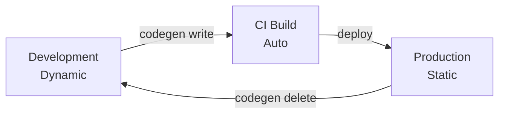

# CLI: codegen Command

JasperFx provides a `codegen` command through its CLI tooling that lets you manage generated code ahead of time. This is essential for production deployments where you want the fastest possible startup by avoiding runtime compilation.

## Setup

To use the `codegen` command, your application must integrate the JasperFx command line extensions:

<!-- snippet: sample_codegen_cli_setup -->
<a id='snippet-sample_codegen_cli_setup'></a>
```cs
public static async Task<int> SetupWithCodegenCommand(string[] args)
{
    return await Host
        .CreateDefaultBuilder()
        .ApplyJasperFxExtensions()
        .RunJasperFxCommands(args);

    // Run with: dotnet run -- codegen preview
    // Run with: dotnet run -- codegen write
    // Run with: dotnet run -- codegen delete
}
```
<sup><a href='https://github.com/JasperFx/jasperfx/blob/master/src/DocSamples/CodegenCliSamples.cs#L49-L63' title='Snippet source file'>snippet source</a> | <a href='#snippet-sample_codegen_cli_setup' title='Start of snippet'>anchor</a></sup>
<!-- endSnippet -->

## TypeLoadMode

The `TypeLoadMode` enum on `GenerationRules` controls how generated types are loaded at runtime:

### Dynamic

<!-- snippet: sample_type_load_mode_dynamic -->
<a id='snippet-sample_type_load_mode_dynamic'></a>
```cs
public static void ConfigureDynamicMode()
{
    // Always generate types at runtime. Best for development.
    var rules = new GenerationRules("MyApp.Generated")
    {
        TypeLoadMode = TypeLoadMode.Dynamic
    };
}
```
<sup><a href='https://github.com/JasperFx/jasperfx/blob/master/src/DocSamples/CodegenCliSamples.cs#L9-L20' title='Snippet source file'>snippet source</a> | <a href='#snippet-sample_type_load_mode_dynamic' title='Start of snippet'>anchor</a></sup>
<!-- endSnippet -->

Always generates and compiles types at runtime. This is the default and is the best choice during development because changes to configuration are immediately reflected without a separate build step.

### Auto

<!-- snippet: sample_type_load_mode_auto -->
<a id='snippet-sample_type_load_mode_auto'></a>
```cs
public static void ConfigureAutoMode()
{
    // Try to load pre-built types first, fall back to runtime generation
    var rules = new GenerationRules("MyApp.Generated")
    {
        TypeLoadMode = TypeLoadMode.Auto
    };
}
```
<sup><a href='https://github.com/JasperFx/jasperfx/blob/master/src/DocSamples/CodegenCliSamples.cs#L36-L47' title='Snippet source file'>snippet source</a> | <a href='#snippet-sample_type_load_mode_auto' title='Start of snippet'>anchor</a></sup>
<!-- endSnippet -->

Tries to load pre-built types from the application assembly first. If the types are not found, falls back to runtime generation and exports the new source code. This is a good middle ground for staging environments.

### Static

<!-- snippet: sample_type_load_mode_static -->
<a id='snippet-sample_type_load_mode_static'></a>
```cs
public static void ConfigureStaticMode()
{
    // Types must be pre-built in the application assembly.
    // Throws if generated types are missing.
    var rules = new GenerationRules("MyApp.Generated")
    {
        TypeLoadMode = TypeLoadMode.Static
    };
}
```
<sup><a href='https://github.com/JasperFx/jasperfx/blob/master/src/DocSamples/CodegenCliSamples.cs#L22-L34' title='Snippet source file'>snippet source</a> | <a href='#snippet-sample_type_load_mode_static' title='Start of snippet'>anchor</a></sup>
<!-- endSnippet -->

Types must already exist in the pre-built application assembly. If any generated type is missing, the application throws an exception at startup. This provides the fastest startup time and is recommended for production.

## Commands

### codegen preview

```bash
dotnet run -- codegen preview
```

Generates all source code and writes it to the console without modifying any files. Use this to inspect the generated code before committing it.

### codegen write

```bash
dotnet run -- codegen write
```

Generates all source code and writes the files into the project directory. The generated files are then compiled into the assembly on the next `dotnet build`. After writing, you can switch to `TypeLoadMode.Static` or `TypeLoadMode.Auto` to load the pre-built types.

### codegen delete

```bash
dotnet run -- codegen delete
```

Removes all previously generated source files from the project directory. Use this to clean up before regenerating or when switching back to `TypeLoadMode.Dynamic`.

## Recommended Workflow

1. **During development**, use `TypeLoadMode.Dynamic` so types are always regenerated as you change configuration.
2. **Before deploying**, run `dotnet run -- codegen write` to persist the generated source files.
3. **In production**, switch to `TypeLoadMode.Static` for the fastest startup. The pre-built types load directly from the compiled assembly with no Roslyn overhead.



## Environment-Based Configuration

A common pattern is to select the `TypeLoadMode` based on the hosting environment:

```csharp
var rules = new GenerationRules("MyApp.Generated")
{
    TypeLoadMode = builder.Environment.IsDevelopment()
        ? TypeLoadMode.Dynamic
        : TypeLoadMode.Static
};
```

This gives you runtime generation during development and pre-built types in production without any manual switching.
