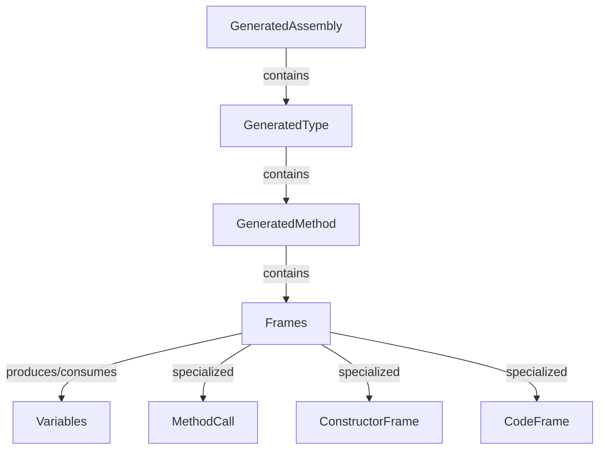

# Code Generation Overview

JasperFx includes a runtime code generation framework that builds and compiles C# classes on the fly. This is the same engine that powers the middleware pipelines in [Wolverine](https://wolverinefx.io) and the document session internals in [Marten](https://martendb.io).

## Why Runtime Code Generation?

Many frameworks rely on reflection or expression trees to wire up handlers, middleware, and data access at runtime. JasperFx takes a different approach: it generates actual C# source code, then compiles it using Roslyn. The result is code that runs at the same speed as hand-written C# with full debuggability -- you can inspect the generated source and set breakpoints in it.

Key benefits:

- **Performance** -- generated code compiles to native IL with no reflection overhead at invocation time.
- **Transparency** -- you can preview the exact C# that will be generated before it runs.
- **Extensibility** -- the frame model lets library authors compose code from reusable building blocks.

## Architecture

The code generation system is organized around a small set of core concepts:



| Concept | Purpose |
|---------|---------|
| **GeneratedAssembly** | Top-level container. Holds one or more types and produces the final C# source file. |
| **GeneratedType** | A single class to be generated. Can inherit from a base class or implement interfaces. |
| **GeneratedMethod** | A method within a generated type. Holds the ordered collection of Frames. |
| **Frame** | A unit of code generation. Each frame writes one or more lines of C# into the method body. |
| **Variable** | Represents a C# variable flowing through frames. Tracks type, name, and which frame creates it. |

## Quick Example

<!-- snippet: sample_codegen_overview -->
<a id='snippet-sample_codegen_overview'></a>
```cs
public static string GenerateGreeterCode()
{
    var rules = new GenerationRules("MyApp.Generated");
    var assembly = new GeneratedAssembly(rules);

    // Add a new type that implements IGreeter
    var type = assembly.AddType("HelloGreeter", typeof(IGreeter));

    // Get the method defined by the interface
    var method = type.MethodFor("Greet");

    // Add a frame that writes a line of code
    method.Frames.Code("return \"Hello, \" + {0};", Use.Type<string>());

    // Generate the C# source code
    var code = assembly.GenerateCode();

    return code;
}

public interface IGreeter
{
    string Greet(string name);
}
```
<sup><a href='https://github.com/JasperFx/jasperfx/blob/master/src/DocSamples/CodegenOverviewSamples.cs#L9-L36' title='Snippet source file'>snippet source</a> | <a href='#snippet-sample_codegen_overview' title='Start of snippet'>anchor</a></sup>
<!-- endSnippet -->

## How It Works

1. Create a `GeneratedAssembly` with a set of `GenerationRules`.
2. Add one or more `GeneratedType` entries, specifying base classes or interfaces.
3. Retrieve `GeneratedMethod` instances (discovered from the base type or added manually).
4. Populate each method with `Frame` objects that describe the code to generate.
5. Call `GenerateCode()` to produce the C# source text.
6. Optionally compile the assembly at runtime to get live `Type` instances.

## TypeLoadMode

JasperFx supports three strategies for loading generated types, controlled by the `TypeLoadMode` enum on `GenerationRules`:

| Mode | Behavior |
|------|----------|
| `Dynamic` | Always generate and compile at runtime. Best for development. |
| `Auto` | Try to load pre-built types from the application assembly; fall back to runtime generation. |
| `Static` | Types must exist in the pre-built assembly. Throws if missing. Fastest startup. |

See [CLI: codegen Command](./cli) for tooling that writes generated code ahead of time.

## Next Steps

- [Frames](./frames) -- learn how the Frame model works and how to write custom frames.
- [Variables](./variables) -- understand how variables flow between frames.
- [MethodCall](./method-call) -- the most commonly used frame for calling existing methods.
- [Generated Types & Methods](./generated-types) -- assembling complete types.
- [Built-in Frames](./built-in-frames) -- catalog of frames shipped with JasperFx.
- [CLI: codegen Command](./cli) -- ahead-of-time code generation tooling.
