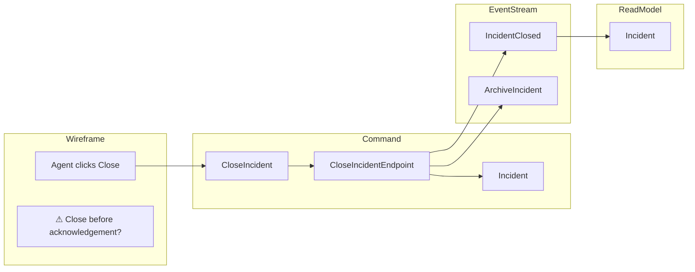

# Event Modeling Overview

[Event Modeling](https://eventmodeling.org) is a way to design a system by laying its behaviour out on a timeline: what a user does, what command that becomes, what events it writes, and what read models fall out the other side. It is normally a whiteboard exercise. The whiteboard is then photographed, dropped in a wiki, and starts drifting away from the code the same afternoon.

JasperFx.Events carries the model as a **semantic model in the codebase** instead. Most of it is derived from code you have already written, so it cannot drift; the small remainder that code genuinely cannot express, you declare.

## The one rule

> **Roles are derived. Names, groupings, labels, links and open questions are declared.**

The command type, the handler, the aggregates, the events emitted, the messages published, the projections, the read models, the trigger kind, the slice pattern — all of that is *stamped by the source that can already see it*: Wolverine from its HTTP, handler and gRPC chains; the Bobcat generator from Gherkin specifications; a source generator from your projection types.

What you write by hand is an **overlay**: the display name of a slice, the bounded context it belongs to, the human label on its trigger ("Agent clicks Close"), a link to a specification that lives outside the compilation, and a hotspot for a question nobody has answered yet.

The overlay sits on the bottom rung of a three-rung ladder of authority — **declared** below **derived from code** below **observed in production** — so a hand-written line can never overwrite what the code actually does, and neither can overwrite what a running system was seen doing. If the code and your overlay disagree about a role, the code wins. See [provenance](/event-modeling/descriptors#provenance-decides-the-merge) for how the ladder is applied, role by role.

Note that this only applies to roles the other rungs *claim*. Nothing but a declaration ever claims a slice's name, its domain, its trigger label or its specification links, so those are yours and stay yours.

## The sample: IncidentService

Every example in this section models the [IncidentService sample](https://github.com/JasperFx/wolverine/tree/main/src/Samples/IncidentService/IncidentService) from the Wolverine repository — a small helpdesk where a customer logs an incident, an agent categorises it, and eventually somebody closes it.

Its events, aggregate and commands:

<!-- snippet: sample_incident_service_events -->
<a id='snippet-sample_incident_service_events'></a>
```cs
public record IncidentLogged(Guid CustomerId, Contact Contact, string Description, Guid LoggedBy);

public record IncidentCategorised(Guid IncidentId, IncidentCategory Category, Guid CategorisedBy);

public record IncidentClosed(Guid ClosedBy);
```
<sup><a href='https://github.com/JasperFx/jasperfx/blob/master/src/DocSamples/EventModeling/IncidentServiceDomain.cs#L12-L20' title='Snippet source file'>snippet source</a> | <a href='#snippet-sample_incident_service_events' title='Start of snippet'>anchor</a></sup>
<!-- endSnippet -->

<!-- snippet: sample_incident_service_aggregate -->
<a id='snippet-sample_incident_service_aggregate'></a>
```cs
public class Incident
{
    public Guid Id { get; set; }
    public int Version { get; set; }
    public IncidentStatus Status { get; set; } = IncidentStatus.Pending;
    public IncidentCategory? Category { get; set; }
    public bool HasOutstandingResponseToCustomer { get; set; }

    public void Apply(IncidentLogged _) { }
    public void Apply(IncidentCategorised e) => Category = e.Category;
    public void Apply(IncidentClosed _) => Status = IncidentStatus.Closed;

    public bool ShouldDelete(Archived @event) => true;
}
```
<sup><a href='https://github.com/JasperFx/jasperfx/blob/master/src/DocSamples/EventModeling/IncidentServiceDomain.cs#L22-L39' title='Snippet source file'>snippet source</a> | <a href='#snippet-sample_incident_service_aggregate' title='Start of snippet'>anchor</a></sup>
<!-- endSnippet -->

<!-- snippet: sample_incident_service_commands -->
<a id='snippet-sample_incident_service_commands'></a>
```cs
public record LogIncident(Guid CustomerId, Contact Contact, string Description, Guid LoggedBy);

public record CategoriseIncident(IncidentCategory Category, Guid CategorisedBy, int Version);

public record CloseIncident(Guid ClosedBy, int Version);

public record ArchiveIncident(Guid IncidentId);
```
<sup><a href='https://github.com/JasperFx/jasperfx/blob/master/src/DocSamples/EventModeling/IncidentServiceDomain.cs#L41-L51' title='Snippet source file'>snippet source</a> | <a href='#snippet-sample_incident_service_commands' title='Start of snippet'>anchor</a></sup>
<!-- endSnippet -->

In the real sample each command has a Wolverine HTTP endpoint next to it — `[WolverinePost("/api/incidents/close/{id}")]` on `CloseIncidentEndpoint`, `[Aggregate]` on the `Incident` parameter. Those attributes are exactly what a derived source reads, which is why none of it is repeated in the overlay.

## Slices and lanes

A **slice** is one vertical stripe of the timeline: one thing the system does, end to end. `CloseIncident` is a slice. So is `GetIncident`, and so is the archival that happens three days later.

Each slice renders across four lanes, top to bottom:

| Lane | Holds | Example in IncidentService |
|------|-------|----------------------------|
| **Wireframe** | Triggers, external systems, hotspots | "Agent clicks Close" |
| **Command** | The command, the handler, the aggregates | `CloseIncident` → `CloseIncidentEndpoint` → `Incident` |
| **EventStream** | Emitted events and published messages | `IncidentClosed`, `ArchiveIncident` |
| **ReadModel** | Projections and read models | `Incident` |



Every slice is also one of four **patterns** — `Command`, `View`, `Automation` or `Translation` — which the source derives from the shape of the code, not from anything you declare.

## What you actually write

The whole overlay for IncidentService is this:

<!-- snippet: sample_incident_service_overlay -->
<a id='snippet-sample_incident_service_overlay'></a>
```cs
public class IncidentServiceModel : EventModelDefinition
{
    // Every source that contributes to "Helpdesk" is folded into one model under this name
    public override string Name => "Helpdesk";

    public override void Configure(EventModelBuilder builder)
    {
        builder.InDomain("Incidents");

        builder.Slice("LogIncident")
            .TriggeredBy("Customer submits the incident form")
            .LinksToSpecification("Log Incident/Logs an incident from the web form");

        builder.Slice("CategoriseIncident")
            .TriggeredBy("Agent picks a category");

        builder.Slice("CloseIncident")
            .TriggeredBy("Agent clicks Close");

        builder.Slice("ArchiveIncident")
            .InDomain("Retention")
            .TriggeredBy("Three days after close");

        builder.Slice("GetIncident")
            .TriggeredBy("Agent opens the incident detail screen");
    }
}
```
<sup><a href='https://github.com/JasperFx/jasperfx/blob/master/src/DocSamples/EventModeling/IncidentServiceEventModel.cs#L5-L35' title='Snippet source file'>snippet source</a> | <a href='#snippet-sample_incident_service_overlay' title='Start of snippet'>anchor</a></sup>
<!-- endSnippet -->

Five slice names, four trigger labels, one domain, one specification link. Nothing about `CloseIncident` the command, `CloseIncidentEndpoint` the handler, or `IncidentClosed` the event — Wolverine already knows all three, and repeating them here would only give them somewhere to drift to.

## Where to go next

- **[The Overlay](/event-modeling/overlay)** — the authoring API in full, plus registration and the escape hatch for flows you do not own.
- **[Hotspots](/event-modeling/hotspots)** — recording what the model has *not* decided yet.
- **[Descriptors](/event-modeling/descriptors)** — the wire shape, the rendering contract, and how sources are assembled into one model.
